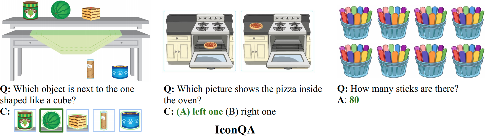
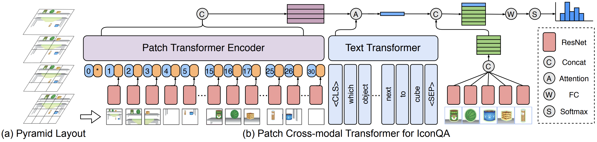

## Introduction

   

       

Data and code for NeurIPS 2021 Paper "[IconQA: A New Benchmark for Abstract Diagram Understanding and Visual Language Reasoning](https://openreview.net/pdf?id=uXa9oBDZ9V1)".

We propose a new challenging benchmark, icon question answering (IconQA), which aims to highlight the importance of **abstract diagram understanding** and **comprehensive cognitive reasoning** in real-world diagram word problems. For this benchmark, we build up a large-scale IconQA dataset that consists of three sub-tasks: multi-image-choice, multi-text-choice, and filling-in-the-blank. Compared to existing VQA benchmarks, IconQA requires not only **perception skills** like object recognition and text understanding, but also diverse **cognitive reasoning** skills, such as geometric reasoning, commonsense reasoning, and arithmetic reasoning.



There are three different sub-tasks in **IconQA**:

- 57,672 multi-image-choice questions
- 31,578 multi-text-choice questions
- 18,189 filling-in-the-blank questions

| Sub-Tasks              | Train  | Validation | Test   | Total  |
| ---------------------- | ------ | ---------- | ------ | ------ |
| *Multi-image-choice*   | 34,603 | 11,535     | 11,535 | 57,672 |
| *Multi-text-choice*    | 18,946 | 6,316      | 6,316  | 31,578 |
| *Filling-in-the-blank* | 10,913 | 3,638      | 3,638  | 18,189 |

We further develop a strong model, **Patch-TRM**, which parses the diagram in a pyramid layout and applies cross-modal Transformers to learn the joint diagram-question feature. Patch-TRM takes patches parsed from a hierarchical pyramid layout and embeds them through ResNet pre-trained on our Icon645 dataset. The joint diagram-question feature is learned via cross-modal Transformers followed by the attention module.



For more details, you can find our website [here](https://iconqa.github.io/) and our paper [here](https://openreview.net/pdf?id=uXa9oBDZ9V1).


## Download the IconQA Dataset

You can download **IconQA** [here](https://iconqa2021.s3.us-west-1.amazonaws.com/iconqa_data.zip) or from [Google Drive](https://drive.google.com/file/d/1Xqdt1zMcMZU5N_u1SAIjk-UAclriynGx), then unzip the dataset into `root_dir/data`. 

Next, download pre-trained models [here](https://iconqa2021.s3.us-west-1.amazonaws.com/saved_models.zip) or from [Google Drive](https://drive.google.com/file/d/1cGHqvOK-aMqby21qeCLs4vv6wnWK3n4E), then unzip them into `root_dir`. 

Or run the command by:

```shell
. tools/download_data_and_models.sh
```


## Run the Patch-TRM model for IconQA

### Requirements

```shell
python=3.6.9
h5py=3.1.0
huggingface-hub=0.0.12
numpy=1.19.5
Pillow=8.3.1
torch=1.9.0+cu111
torchvision=0.10.0+cu111
tqdm=4.61.2
```

Install all required python dependencies:

```shell
pip install -r requirements.txt
```

### Process IconQA Data

Generate the question dictionary:

```shell
cd tools
python create_dictionary.py
```

Generate answer labels:

```shell
python create_ans_label.py
```

### Generate image features

Generate the image patch features from the icon classifier model that is pre-trained on our proposed Icon645 dataset:

```shell
python generate_img_patch_feature.py --icon_pretrained True --patch_split 79
```

- `--icon_pretrained True`: the backbone network is pre-trained on icon data
- `--patch_split 79`: the image is hierarchically parsed into 79 patches before feature extraction

Generate the image choice features for the `multi-image-choice` sub-task from the icon classifier model that is pre-trained on our proposed Icon645 dataset:

```shell
python generate_img_choice_feature.py --icon_pretrained True
```

- `--icon_pretrained True`: the backbone network is pre-trained on icon data

Optionally, you can set `--icon_pretrained False` to generate image features from the ResNet101 model pre-trained on natural image dataset ImageNet.

The above steps are time-consuming and can take several hours. Instead, you can alternatively download the extracted features [here](https://iconqa2021.s3.us-west-1.amazonaws.com/embeddings.zip) or from [Google Drive](https://drive.google.com/file/d/1VuEpfqUCnv1gVa3roo9HpxtjsQ5o4Zqd), then unzip them into `root_dir/data`. Or run the command by:

```shell
. tools/download_img_feats.sh
```

Before moving on, please check the following directories:

```
data/
├── dictionary.pkl
├── iconqa_data
│   └── iconqa
│       ├── test
│       ├── train
│       └── val
├── img_choice_embeddings
│   └── resnet101_pool5_icon
│       ├── iconqa_test_choose_img_resnet101_pool5_icon.pth
│       ├── iconqa_train_choose_img_resnet101_pool5_icon.pth
│       └── iconqa_val_choose_img_resnet101_pool5_icon.pth
├── patch_embeddings
│   └── resnet101_pool5_79_icon
│       ├── iconqa_test_choose_img_resnet101_pool5_79_icon.pth
│       ├── iconqa_test_choose_txt_resnet101_pool5_79_icon.pth
│       ├── iconqa_test_fill_in_blank_resnet101_pool5_79_icon.pth
│       ├── iconqa_train_choose_img_resnet101_pool5_79_icon.pth
│       ├── iconqa_train_choose_txt_resnet101_pool5_79_icon.pth
│       ├── iconqa_train_fill_in_blank_resnet101_pool5_79_icon.pth
│       ├── iconqa_val_choose_img_resnet101_pool5_79_icon.pth
│       ├── iconqa_val_choose_txt_resnet101_pool5_79_icon.pth
│       └── iconqa_val_fill_in_blank_resnet101_pool5_79_icon.pth
├── pid_splits.json
├── problems.json
├── trainval_choose_img_ans2label.pkl
├── trainval_choose_img_label2ans.pkl
├── trainval_choose_txt_ans2label.pkl
├── trainval_choose_txt_label2ans.pkl
├── trainval_fill_in_blank_ans2label.pkl
└── trainval_fill_in_blank_label2ans.pkl

saved_models/
├── choose_img
│   └── exp_paper
│       └── best_model.pth
├── choose_txt
│   └── exp_paper
│       └── best_paper.pth
├── fill_in_blank
│   └── exp_paper
│       └── best_paper.pth
└── icon_classification_ckpt
    └── icon_resnet101_LDAM_DRW_lr0.01_0
        └── ckpt.epoch66_best.pth.tar
```

### Run the the *filling-in-the-blank* sub-task

Train the Patch_TRM model for the *filling-in-the-blank* sub-task:

```shell
cd run_fill_in_blank
python train.py --model patch_transformer_ques_bert --label exp0 
```

Evaluate the Patch_TRM model for the *filling-in-the-blank* sub-task:

```shell
python eval.py --model patch_transformer_ques_bert --label exp0
```

Or, you can evaluate the Patch_TRM model for the *filling-in-the-blank* sub-task with our trained model:

```shell
python eval.py --model patch_transformer_ques_bert --label exp_paper
```

### Run the *multi-text-choice* sub-task

Train the Patch_TRM model for the *multi-text-choice* sub-task:

```shell
cd run_choose_txt
python train.py --model patch_transformer_ques_bert --label exp0 
```

Evaluate the Patch_TRM model for the *multi-text-choice* sub-task:

```shell
python eval.py --model patch_transformer_ques_bert --label exp0
```

Or, you can evaluate the Patch_TRM model for the *multi-text-choice* sub-task with our trained model:

```shell
python eval.py --model patch_transformer_ques_bert --label exp_paper
```

### Run the *multi-image-choice* sub-task

Train the Patch_TRM model for the *multi-image-choice* sub-task:

```shell
cd run_choose_img
python train.py --model patch_transformer_ques_bert --label exp0 
```

Evaluate the Patch_TRM model for the *multi-image-choice* sub-task:

```shell
python eval.py --model patch_transformer_ques_bert --label exp0
```

Or, you can evaluate the Patch_TRM model for the *multi-image-choice* sub-task with our trained model:

```shell
python eval.py --model patch_transformer_ques_bert --label exp_paper
```

### Evaluate the IconQA results

Calculate the accuracies over different skills based on result json files reported in the paper:

```shell
cd tools
python sub_acc.py \
--fill_in_blank_result exp_patch_transformer_ques_bert.json \
--choose_txt_result exp_patch_transformer_ques_bert.json \
--choose_img_result exp_patch_transformer_ques_bert.json
```

Calculate the accuracies over different skills based on user-specified result json files:

```shell
python sub_acc.py \
--fill_in_blank_result exp0_patch_transformer_ques_bert.json \
--choose_txt_result exp0_patch_transformer_ques_bert.json \
--choose_img_result exp0_patch_transformer_ques_bert.json
```


## Icon645 Dataset

In addition to **IconQA**, we also present **Icon645**, a large-scale dataset of icons that cover a wide range of objects:

- **645,687** colored icons
- **377** different icon classes

These collected icon classes are frequently mentioned in the IconQA questions. In this work, we use the icon data to pre-train backbone networks on the icon classification task in order to extract semantic representations from abstract diagrams in IconQA. On top of pre-training encoders, the large-scale icon data could also contribute to open research on abstract aesthetics and symbolic visual understanding. 


You can download **Icon645** [here](https://iconqa2021.s3.us-west-1.amazonaws.com/icon645.zip) or from [Google Drive](https://drive.google.com/file/d/1AsqzjBjgJedgnVAOpYA9WRfMN5k6w9an). Or run the command by:

```shell
cd data
wget https://iconqa2021.s3.us-west-1.amazonaws.com/icon645.zip
unzip icon645.zip
```

File structures for the **Icon645** dataset:

```
icon645
|   LICENCE.md
|   metadata.json
└───colored_icons_final
    |
    └───acorn
    |   |   image_id1.png
    |   |   image_id2.png
    |   |   ...
    |   
    └───airplane
    |   |   image_id3.png
    |   |   ...
    |      
    |   ...
```


## Citation

If the paper or the dataset inspires you, please cite us:

```
@inproceedings{lu2021iconqa,
  title = {IconQA: A New Benchmark for Abstract Diagram Understanding and Visual Language Reasoning},
  author = {Lu, Pan and Qiu, Liang and Chen, Jiaqi and Xia, Tony and Zhao, Yizhou and Zhang, Wei and Yu, Zhou and Liang, Xiaodan and Zhu, Song-Chun},
  booktitle = {The 35th Conference on Neural Information Processing Systems (NeurIPS 2021) Track on Datasets and Benchmarks},
  year = {2021}
}
```


## License

[](https://creativecommons.org/licenses/by-sa/4.0/)

Our dataset is licensed under a [Creative Commons Attribution-NonCommercial-ShareAlike 4.0 International License](http://creativecommons.org/licenses/by-nc-sa/4.0/).
