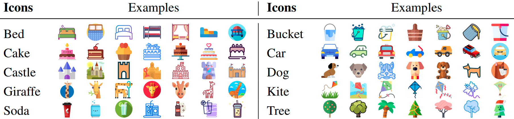

# IconQA

[](https://creativecommons.org/licenses/by-sa/4.0/)


## About

**IconQA** is a new diverse abstract visual question answering dataset that highlights the importance of **abstract diagram understanding** and **comprehensive cognitive reasoning** in real-world problems.


There are three different sub-tasks in **IconQA**:

- 57,672 image choice MC questions
- 31,578 text chioce MC questions
- 18,189 fill-in-the-blank  questions

| Sub-Tasks            | Train  | Validation | Test   | Total  |
| -------------------- | ------ | ---------- | ------ | ------ |
| *Multi-image-choice* | 34,603 | 11,535     | 11,535 | 57,672 |
| *Multi-text-choice*  | 18,946 | 6,316      | 6,316  | 31,578 |
| *Multi-image-choice* | 10,913 | 3,638      | 3,638  | 18,189 |

In addition to **IconQA**, we also present **Icon645**, a large-scale dataset of icons that cover a wide range of objects:

- **645,687** colored icons
- **377** different icon classes



> For more details, you can find our website [here](https://iconqa.github.io/) and our paper [here]().


## Download

Our dataset is licensed under a [Creative Commons Attribution-NonCommercial-ShareAlike 4.0 International License][cc-by-nc-sa]. Please read the license before you use, change, or share our dataset.

You can download **IconQA** [here](https://iconqa2021.s3.us-west-1.amazonaws.com/iconqa.zip). Or run the commands by:

```shell
cd data
wget https://iconqa2021.s3.us-west-1.amazonaws.com/iconqa.zip
unzip iconqa.zip
```

You can download **Icon645** [here](https://iconqa2021.s3.us-west-1.amazonaws.com/iconqa.zip). Or run the commands by:

```shell
cd data
wget https://iconqa2021.s3.us-west-1.amazonaws.com/icon645.zip
unzip icon645.zip
```

File structures for the **IconQA** dataset:

```
IconQA
|   LICENSE.md
|   metadata.json
|   pid2skills.json
|   pid_splits.json
|   problems.json
|   skills.json
└───test
│   │
│   └───choose_img
│   |   |
│   |   └───question_id
│   |   |   |   image.png
|   |   |   |   data.json
|   |   |   |   choice_0.png
|   |   |   |   choice_1.png
|   |   |   |   ...
|   |   |
|   |   └───question_id
|   |   |   ...
|   |   
|   └───choose_txt
|   |   |  
|   |   └───question_id
|   |   |   |   image.png
|   |   |   |   data.json
|   |   | 
|   |   └───question_id
|   |   |   ...
|   |
|   └───fill_in_blank
|       |  
|       └───question_id
|       |   |   image.png
|       |   |   data.json
|       | 
|       └───question_id
|       |   ...
|   
└───train
|   |   same as test
|   
└───val
    |   same as test
```

File structures for the **Icon645** dataset:

```
Icon645
|   LICENCE.md
|   metadata.json
└───colored_icons_final
    |
    └───acorn
    |   |   image_id1.png
    |   |   image_id2.png
    |   |   ...
    |   
    └───airplane
    |   |   image_id3.png
    |   |   ...
    |      
    |   ...
```


## Citation

If the paper or the dataset inspires you, please cite us:

```
@inproceedings{lu2021iconqa,
  title = {IconQA: A New Benchmark for Abstract Diagram Understanding and Visual Language Reasoning},
  author = {Lu, Pan and Qiu, Liang and Chen, Jiaqi and Xia, Tony and Zhao, Yizhou and Zhang, Wei and Yu, Zhou and Liang, Xiaodan and Zhu, Song-Chun},
  booktitle = {Submitted to the 35th Conference on Neural Information Processing Systems (NeurIPS 2021) Track on Datasets and Benchmarks},
  year = {2021}
}
```


## License

This work is licensed under a
[Creative Commons Attribution-NonCommercial-ShareAlike 4.0 International License][cc-by-nc-sa].

[![CC BY-NC-SA 4.0][cc-by-nc-sa-image]][cc-by-nc-sa]

[cc-by-nc-sa]: http://creativecommons.org/licenses/by-nc-sa/4.0/
[cc-by-nc-sa-image]: https://licensebuttons.net/l/by-nc-sa/4.0/88x31.png
[cc-by-nc-sa-shield]: https://img.shields.io/badge/License-CC%20BY--NC--SA%204.0-lightgrey.svg

