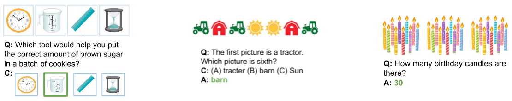
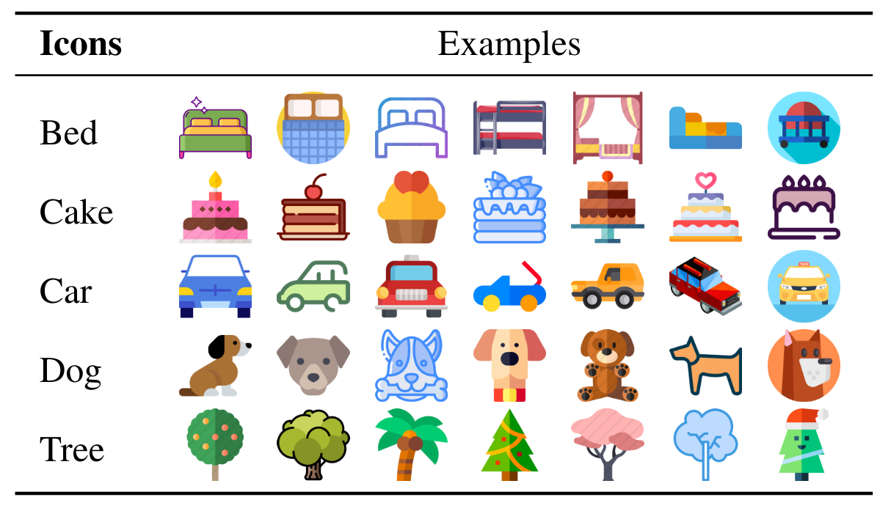

# IconQA

Shield: [![CC BY-NC-SA 4.0][cc-by-nc-sa-shield]][cc-by-nc-sa]

## About



IconQA: a new diverse abstract visual question answering dataset that highlights the importance of **abstract diagram understanding** and **comprehensive cognitive reasoning** in real-world problems

Icon645: a new icon image dataset that covers a wide range of objects

> For more details, you can find our website [here](iconqa.github.io) and our paper [here]().

## Overview

There are three different sub-tasks in IconQA:

- 57672 image choice MC questions
- 31578 text chioce MC questions
- 18189 fill-in-the-blank  questions

| Tasks              | Train  | Validation | Test   | Total  |
| ------------------ | ------ | ---------- | ------ | ------ |
| Multi-image-choice | 34,603 | 11,535     | 11,535 | 57,672 |
| Multi-text-choice  | 18,946 | 6,316      | 6,316  | 31,578 |
| Multi-image-choice | 10,913 | 3,638      | 3,638  | 18,189 |

In addition to IconQA, we also present Icon645, a dataset of icons for training abstract image classifiers

- **645,687** colored icons
- **377** different icon classes

## Examples

### IconQA


### Icon645



## Download

Our dataset is licensed under a [Creative Commons Attribution-NonCommercial-ShareAlike 4.0 International License][cc-by-nc-sa]. Please read the license before you use, change, or share our dataset.

- You can download IconQA [here](https://iconqa2021.s3.us-west-1.amazonaws.com/iconqa.zip).
- You can download Icon645 [here](https://iconqa2021.s3.us-west-1.amazonaws.com/icon645.zip).

## File structures

### IconQA

```
IconQA
|
└───test
│   │
│   └───choose_img
│   |   |
│   |   └───id1
│   |   |   |   image.png
|   |   |   |   data.json
|   |   |   |   choice_0.png
|   |   |   |   choice_1.png
|   |   |   |   ...
|   |   |
|   |   └───id2
|   |   |   ...
|   |   
|   └───choose_txt
|   |   |  
|   |   └───id1
|   |   |   |   image.png
|   |   |   |   data.json
|   |   | 
|   |   └───id2
|   |   |   ...
|   |
|   └───fill_in_blank
|       |  
|       └───id1
|       |   |   image.png
|       |   |   data.json
|       | 
|       └───id2
|       |   ...
|   
└───train
|   |   same as test
|   
└───val
    |   same as test
```

### Icon645

```
Icon645
|
└───dog
|   |   
|   |
|   |   ...
|   
└───cat
|   |   
|   |   ...
|      
|   ...

```

## Citation

If the paper or the dataset inspires you, please cite us:

```
@inproceedings{lu2021iconqa,
  title = {IconQA: A New Dataset for Abstract Diagram Understanding and Visual Language Reasoning},
  author = {Lu, Pan and Qiu, Liang and Chen, Jiaqi and Xia, Tony and Zhao, Yizhou and Zhang, Wei and Yu, Zhou and Liang, Xiaodan and Zhu, Song-Chun},
  booktitle = {Submitted to the 35th Conference on Neural Information Processing Systems (NeurIPS 2021) Track on Datasets and Benchmarks},
  year = {2021}g
}
```


This work is licensed under a
[Creative Commons Attribution-NonCommercial-ShareAlike 4.0 International License][cc-by-nc-sa].

[![CC BY-NC-SA 4.0][cc-by-nc-sa-image]][cc-by-nc-sa]

[cc-by-nc-sa]: http://creativecommons.org/licenses/by-nc-sa/4.0/
[cc-by-nc-sa-image]: https://licensebuttons.net/l/by-nc-sa/4.0/88x31.png
[cc-by-nc-sa-shield]: https://img.shields.io/badge/License-CC%20BY--NC--SA%204.0-lightgrey.svg